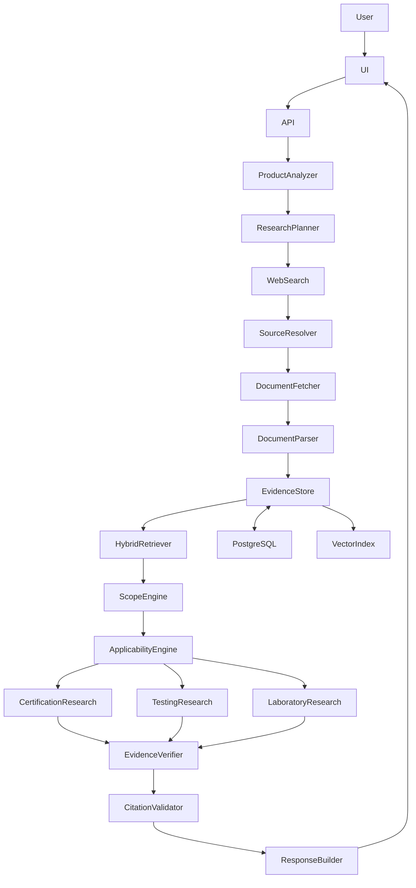

# 🧭 BIS-Compass: AI Indian Standards & Compliance Intelligence Platform

[](https://fastapi.tiangolo.com)
[](https://reactjs.org/)
[](https://www.typescriptlang.org/)
[](https://tailwindcss.com/)
[](LICENSE)
[](https://www.sih.gov.in/)

> **BIS-Compass** is an AI-assisted compliance research platform. It dynamically retrieves and analyzes authoritative sources (official BIS portals, Government gazettes). Cached evidence is reused for efficiency. The application does not claim official BIS approval and does not replace professional regulatory/legal advice.

---

## 🌟 Key Features

### 1. 🔍 Open-World Product Intelligence
- **Natural Language Understanding**: Enter any arbitrary product (e.g., *"Stainless steel vacuum insulated flask for domestic use"*, *"Cotton T-shirt"*, or novel products like *"Biodegradable seaweed packaging film"*).
- **False-Positive Suppression**: Separates product identity from raw materials to eliminate invalid matches (e.g., prevents steel flasks from matching raw steel rebar or electrical cables).
- **Abstention & Clarification**: Gracefully abstains when no standard applies and generates targeted clarification questions for ambiguous queries (e.g., *"We manufacture steel products"*).

### 2. 📋 Clause-by-Clause Applicability Reasoning
- Delivers concrete, transparent reasoning: **"Why does this standard apply?"** with cited clauses, page numbers, and mandatory Quality Control Order (QCO) scopes.

### 3. 🤖 Specialized Multi-Agent Pipeline
- **Orchestrator Agent**: Coordinates end-to-end multi-agent research across live web retrieval, standard discovery, scope verification, and synthesis.
- **Certification Agent**: Identifies governing BIS certification schemes (Scheme I ISI Mark, Scheme II CRS, etc.), marking rules, and documentation prerequisites.
- **Testing Agent**: Maps mandatory testing parameters, standard test methods, and turnaround times.
- **Compliance Gap Agent**: Compares manufacturer spec sheets against standard requirements, scoring fulfillment percentages and risk levels.
- **Laboratory Agent**: Recommends BIS-recognized and NABL-accredited laboratories with contact details and proximity filtering.
- **Citation Verification Agent**: Verifies legal citations, gazette notifications, and standards revisions against retrieved evidence.

### 4. 📄 Document Ingestion & OCR Engine
- Supports ingestion of **PDF, DOCX, and TXT** technical specifications, test sheets, and product manuals using PyMuPDF and python-docx.
- Automatically generates structured text chunks, metadata, and SHA-256 checksum tracking.

### 5. 🌐 Authoritative Live Web Retrieval
- Concurrent web search engine with 5-tier domain authority ranking prioritizing Tier-1 `bis.gov.in` (100), Tier-2 `egazette.gov.in` / `nic.in` / `gov.in` (90–94), Tier-3 `iso.org` / `iec.ch` (80–88), and reputable regulatory repositories.

### 6. 📊 RAG Evaluation & Audit Trail
- Benchmarking dashboard reporting precision, groundedness, and safe abstention accuracy.
- Comprehensive, immutable audit trail tracking all user queries and compliance determinations in `research_sessions`.

---

## 🏗️ Architecture



---

## 💻 Tech Stack

| Layer | Technologies |
|---|---|
| **Frontend** | React 18, TypeScript, Vite 5, Tailwind CSS, Lucide React, TanStack Query, Axios |
| **Backend API** | FastAPI, Uvicorn, Pydantic v2, Python 3.10+ |
| **Database & Cache** | SQLAlchemy 2.0, PostgreSQL with `pgvector` (automatic fallback to local SQLite `bis_compass.db`) |
| **Live Research** | DDGS, HTTPX, BeautifulSoup4, PyMuPDF (`pymupdf`), SHA-256 Content Hashing |
| **Multi-Agent Engine** | OpenWorldProductAnalyzer, ComplianceResearchPlanner, WebResearchEngine, StandardDiscoveryEngine |
| **LLM & Inference** | NVIDIA NIM API / Mistral (with resilient deterministic scope evaluator fallback) |
| **Containerization** | Docker, Docker Compose |

---

## 🚀 Quick Start Guide

### Prerequisites
- **Python**: 3.10 or higher
- **Node.js**: 18 or higher (npm 9+)
- **Git**

---

### Option A: One-Command Start (Windows PowerShell)

Run the included startup script to launch both backend and frontend servers simultaneously:
```powershell
.\start_app.ps1
```
- **Frontend App**: [http://localhost:5174](http://localhost:5174)
- **Backend API**: [http://127.0.0.1:8002](http://127.0.0.1:8002)
- **Interactive Swagger Docs**: [http://127.0.0.1:8002/docs](http://127.0.0.1:8002/docs)

---

### Option B: Manual Setup

#### 1. Backend Setup
```powershell
# Navigate to backend
cd backend

# (Optional) Create and activate virtual environment
python -m venv venv
.\venv\Scripts\Activate.ps1

# Install dependencies
pip install -r requirements.txt

# Run FastAPI server
$env:PYTHONPATH = (Get-Location).Path
python -m uvicorn app.main:app --host 127.0.0.1 --port 8002 --reload
```

#### 2. Frontend Setup
In a new terminal:
```powershell
# Navigate to frontend
cd frontend

# Install dependencies
npm install

# Start Vite dev server
npm run dev
```

---

### Option C: Docker Compose

To run the complete stack (PostgreSQL with `pgvector`, FastAPI backend, and Nginx frontend) via Docker:
```bash
docker compose up --build
```
- Frontend UI: `http://localhost:3000`
- Backend API: `http://localhost:8000`

---

## 📡 REST API Reference

| Method | Endpoint | Description |
|---|---|---|
| `GET` | `/health` | System health and database connectivity check |
| `GET` | `/api/research/health` | Live web research engine & official BIS portal connectivity probe |
| `GET` | `/api/ai/health` | NVIDIA NIM LLM provider connectivity and latency probe |
| `GET` | `/api/stats` | High-level metrics (standards, laboratories, audits) |
| `POST` | `/api/analyze` | **Flagship**: Live authoritative product compliance research |
| `POST` | `/api/products/analyze` | Open-world entity extraction and product categorization |
| `GET` | `/api/standards` | List and search indexed Indian Standards with filters |
| `GET` | `/api/standards/{id}` | Detailed standard specification with clauses and schemes |
| `POST` | `/api/compliance/analyze` | Clause-by-clause compliance gap analysis (supports live discovery) |
| `GET` | `/api/laboratories` | Directory of BIS-recognized accredited testing labs |
| `POST` | `/api/documents/upload` | Upload & extract text/chunks from PDF, DOCX, or TXT |
| `POST` | `/api/web/search` | Search authoritative BIS & government web domains |
| `POST` | `/api/chat` | Conversational compliance research advisor |
| `GET` | `/api/evaluation/metrics` | RAG retrieval and evaluation metrics |
| `POST` | `/api/evaluation/run` | Execute automated RAG evaluation benchmark |
| `GET` | `/api/audit` | Retrieve complete compliance audit logs |

---

## 🧪 Automated Testing

### 1. Run Live BIS Research & Scope Gating Verification Test
Validates dynamic discovery of `IS 4375:2019` for arbitrary apparel (`"100% Combed Cotton T-Shirt"`), 0 static seed leakage, official BIS Tier-1 source usage, and targeted clarification generation:
```powershell
python scripts/test_cotton_tshirt_e2e.py
```

### 2. Run Clarified Product Verification Test
Validates that providing clarified parameters (`"100% Combed Cotton T-Shirt (Men's knitted sports shirt/T-shirt)"`) immediately transitions `IS 4375` from potential to directly applicable:
```powershell
python scripts/test_clarified_tshirt.py
```

### 3. Run Unit & Component Tests
```powershell
python -m pytest backend/tests -v
```

### 4. Run Live Authoritative Research Acceptance Test
Proves live web discovery, evidence extraction, and applicability analysis on an arbitrary novel product with zero preloaded knowledge:
```powershell
python scripts/test_live_research.py
```

### 3. Run Frontend Type Check & Build
```powershell
cd frontend
npx tsc --noEmit
npm run build
```

---

## ⚙️ Configuration (`backend/.env`)

| Variable | Default Value | Description |
|---|---|---|
| `DATABASE_URL` | `postgresql://...` | PostgreSQL connection string (falls back to local SQLite if unreachable) |
| `NVIDIA_API_KEY` | `nvapi-...` | Optional NVIDIA NIM API key for LLM chat & structured reasoning |
| `NVIDIA_CHAT_MODEL` | `nvidia/llama-3.1-nemotron-70b-instruct` | Primary LLM model |
| `NVIDIA_FALLBACK_CHAT_MODEL` | `mistralai/mistral-7b-instruct-v0.3` | Secondary fallback model |
| `WEB_SEARCH_PROVIDER` | `ddgs` | Live search provider (`ddgs`, `official_bis`, `external_api`) |
| `WEB_SEARCH_ENABLED` | `true` | Enable live online research |
| `BACKEND_CORS_ORIGINS` | `["*"]` | Allowed CORS origins |
| `USER_AGENT` | `BIS-Compass/2.0` | User agent header for authoritative web retrieval |

> **Note on Live Research & Offline Behavior**: When live research is enabled, BIS-Compass queries authoritative official BIS and government web sources. If live research is unavailable due to network limitations, the system inspects previously verified cached evidence and clearly alerts the user: *"Live research is currently unavailable. This result is based only on previously retrieved evidence."*

---

## 🌐 Dynamic Knowledge Acquisition

BIS-Compass dynamically retrieves current authoritative standards, regulations, Quality Control Orders (QCOs), certification information, testing requirements, and laboratory information from verified online sources and caches validated evidence into its database cache for subsequent queries (`SEARCH FIRST → CACHE SECOND → REUSE THIRD`).

The system does not depend on a fixed list of preloaded standards or laboratories to operate; any arbitrary product can be investigated live.

---

## 🏆 Smart India Hackathon (SIH 2026)
Developed as an open-world AI research platform to empower Indian industry, MSMEs, and global importers with instant, transparent, and verifiable compliance intelligence under the **Bureau of Indian Standards Act, 2016**.


newprmpt

# BIS-COMPASS — PRODUCTION-GRADE REBUILD AND ACCURACY CORRECTION

## THIS IS A HIGH-PRIORITY CORRECTION

The current BIS-Compass implementation is NOT acceptable as a final product.

The UI looks complete, but the underlying intelligence is producing unsafe and unreliable compliance results.

Examples of unacceptable behavior currently observed:

### User input

> "Want To Sell My Groundnut Oil Across India"

### Current incorrect behavior

It creates:

> Product Family: General Manufacturing

> Intended Application: Operational usage of Want To Sell My Groundnut Oil Across India

Then returns:

> IS 302-2-76:1999

with:

> "Indian Standard for Want To Sell My Groundnut Oil Across India"

This is unacceptable.

The system must NEVER invent a standard title, standard scope, clause, laboratory requirement, certification requirement, or applicability relationship.

Another unacceptable example:

> "Type Test — as per IS Unknown"

This MUST NEVER be shown.

Another unacceptable behavior is using a generic blog as the supporting evidence for a government compliance determination.

---

# 1. OBJECTIVE

Transform BIS-Compass from a prototype/demo application into a **real evidence-grounded compliance research and decision-support application**.

The system must:

1. Understand arbitrary natural-language product requests.
2. Correctly distinguish product identity, business intent, material, and application.
3. Perform genuine LLM reasoning through the configured NVIDIA API.
4. Dynamically research authoritative current sources.
5. Retrieve actual BIS standards and official regulatory information.
6. Verify that a retrieved standard really applies to the product.
7. Never invent a standard or clause.
8. Never fabricate certification or testing requirements.
9. Never fabricate laboratories.
10. Explicitly abstain when evidence is insufficient.
11. Clearly distinguish verified evidence from general web discovery.
12. Provide traceable citations for every important factual claim.
13. Work with products that are NOT predefined.
14. Work with an empty database by performing live research.
15. Use cached knowledge only as a performance optimization, never as the sole source of truth.
16. Use the LLM as an actual reasoning component, not a decorative feature.
17. Produce results suitable for a serious SIH government-project demonstration.

---

# 2. DO NOT PATCH THE CURRENT OUTPUT

Do NOT solve the current problem by adding:

```python
if "groundnut oil" in text:
    return some_standard
```

Do NOT add:

```python
KNOWN_PRODUCTS = [...]
```

Do NOT add:

```python
KNOWN_STANDARD_MAPPINGS = {...}
```

Do NOT create special rules for each failing example.

Fix the architecture.

---

# 3. FIRST TASK — PERFORM A FULL SYSTEM AUDIT

Before modifying the implementation, inspect the entire codebase.

Identify:

* where the LLM is configured;
* whether the NVIDIA API is actually being called;
* which model is being used;
* where API failures are swallowed;
* whether fallback heuristics silently replace the LLM;
* where product extraction occurs;
* where candidate standards are generated;
* whether standards come from seed data;
* how web search is invoked;
* whether web results are actually fetched;
* how PDFs are parsed;
* how scope is extracted;
* how applicability is calculated;
* how citations are generated;
* how labs are generated;
* how certification requirements are generated;
* which values are hardcoded;
* which values are mock/demo fixtures;
* how compliance documents are analyzed;
* how confidence is calculated.

Generate an internal audit report before implementation.

The report must explicitly identify every place where unsupported factual information can reach the user.

---

# 4. NVIDIA LLM MUST ACTUALLY WORK

The application currently appears to have an LLM integration, but the output suggests that the actual LLM path is either failing, being bypassed, or being used incorrectly.

Fix this first.

Create a real provider abstraction:

```text
LLMProvider
├── chat()
├── structured_output()
└── health_check()
```

Implement:

```text
NVIDIAProvider
```

using the configured NVIDIA API.

Environment:

```env
NVIDIA_API_KEY=
NVIDIA_BASE_URL=https://integrate.api.nvidia.com/v1
NVIDIA_CHAT_MODEL=
NVIDIA_FALLBACK_CHAT_MODEL=
NVIDIA_EMBED_MODEL=
```

Never hard-code secrets.

---

# 5. LLM HEALTH CHECK

Create:

```text
GET /api/ai/health
```

The endpoint must actually make a minimal authenticated request to the configured provider.

Return:

```json
{
  "provider": "nvidia",
  "configured": true,
  "reachable": true,
  "model": "...",
  "latency_ms": 842,
  "error": null
}
```

If the API fails:

```json
{
  "provider": "nvidia",
  "configured": true,
  "reachable": false,
  "model": "...",
  "latency_ms": null,
  "error": "..."
}
```

DO NOT silently fall back.

The UI must show:

```text
AI Engine
● Connected
```

or:

```text
AI Engine
● Unavailable
```

---

# 6. DO NOT HIDE LLM FAILURE

Current behavior appears to be:

```text
NVIDIA unavailable
↓
heuristic parser
↓
pretend result is complete
```

REMOVE THIS behavior.

If the requested operation requires LLM reasoning and NVIDIA is unavailable, show:

> AI reasoning service is currently unavailable. The system cannot safely perform open-world semantic analysis at this time.

The application can still use deterministic functions where appropriate, but must never pretend the LLM was used.

---

# 7. EVERY ANALYSIS MUST RECORD THE AI EXECUTION PATH

For each analysis store:

```text
analysis_id
llm_provider
llm_model
llm_called
llm_latency
llm_error
embedding_model
web_search_used
sources_used
fallback_used
```

The UI's technical diagnostics must show:

```text
LLM:
NVIDIA — SUCCESS

Model:
<configured model>

LLM calls:
4

Web research:
YES

Cached evidence:
2
Live sources:
6
```

All values must be real runtime values.

---

# 8. OPEN-WORLD PRODUCT UNDERSTANDING

The user can enter ANYTHING.

Examples:

```text
"I want to sell groundnut oil across India."

"We manufacture cotton T-shirts."

"We manufacture biodegradable seaweed food packaging film."

"We import industrial ultrasonic cleaning equipment."

"We make a smart textile sensor patch."

"We manufacture a custom composite building panel."
```

There must be no fixed product whitelist.

---

# 9. SEPARATE FOUR DIFFERENT CONCEPTS

The system MUST distinguish:

### Product

What is actually being made/sold/imported.

### Material

What it is made from.

### Intended Use

What it is used for.

### Commercial Intent

What the user wants to do:

* manufacture
* sell
* import
* distribute
* export
* certify
* test

These are NOT interchangeable.

For:

> "Want to sell my groundnut oil across India"

correct understanding should be approximately:

```text
Commercial activity:
Sell/distribute

Product:
Groundnut oil

Likely product form:
Edible oil

Market:
India

Potential regulatory context:
Food / edible oil

Uncertainty:
Need confirmation whether the user manufactures, imports,
or only distributes.
```

DO NOT create:

```text
Product:
Want To Sell My Groundnut Oil Across India
```

That is an obvious NLP failure.

---

# 10. PRODUCT EXTRACTION SCHEMA

Use structured LLM output:

```json
{
  "product": {
    "name": "",
    "normalized_name": "",
    "description": ""
  },
  "commercial_intent": "",
  "materials": [],
  "components": [],
  "intended_use": "",
  "application": "",
  "industry": "",
  "physical_form": "",
  "technical_attributes": {},
  "possible_regulatory_domains": [],
  "uncertainties": [],
  "clarification_required": false,
  "clarification_questions": [],
  "confidence": 0
}
```

The LLM must return ONLY this structure.

---

# 11. PRODUCT NAME NORMALIZATION

The system must strip conversational/business phrasing.

Example:

Input:

> "Want To Sell My Groundnut Oil Across India"

Output:

```text
Product name:
Groundnut oil
```

Input:

> "I manufacture stainless steel vacuum flask bottles for home use"

Output:

```text
Product name:
Stainless steel vacuum flask
```

Input:

> "We are planning to sell biodegradable seaweed packaging film"

Output:

```text
Product name:
Biodegradable seaweed packaging film
```

Never use the entire user sentence as the product name.

---

# 12. CLARIFICATION

The LLM must determine whether enough information exists.

Example:

> "We make steel products."

Return:

```text
clarification_required = true
```

Questions:

```text
What type of steel product do you manufacture?

What is its intended use?
```

Do not randomly retrieve standards before the product is sufficiently understood.

---

# 13. RESEARCH PLANNER

After product understanding, create a dynamic research plan.

Example:

Input:

> Groundnut oil intended for sale in India.

Research plan:

```text
1. Identify Indian regulatory/standards framework for edible groundnut oil.
2. Search official BIS sources.
3. Search relevant government/FSSAI regulatory sources.
4. Identify applicable standard/specification.
5. Check current mandatory status or applicable regulatory notification.
6. Determine testing requirements.
7. Determine certification/licensing requirements where applicable.
8. Verify source dates and current status.
```

This plan must be generated based on the actual product.

---

# 14. RESEARCH MUST BE DYNAMIC

Do NOT make:

```text
seed standards
```

the primary research mechanism.

The database may cache previous research.

The authoritative origin is the current source.

Flow:

```text
User
↓
Product Understanding
↓
Research Planning
↓
Live Search
↓
Source Fetch
↓
Document Extraction
↓
Evidence Store
↓
RAG
↓
Applicability
↓
Final Answer
```

---

# 15. AUTHORITY HIERARCHY

For government/compliance answers use:

### Tier 1

Official BIS sources.

### Tier 2

Government of India / official regulatory authorities.

For food-related products this may include relevant official food/regulatory sources.

### Tier 3

Official international organizations where relevant.

### Tier 4

Reputable secondary sources.

### Tier 5

General web content.

Tier 4/5 must NEVER override Tier 1/2.

---

# 16. BLOGS MUST NOT BE USED AS PRIMARY LEGAL/COMPLIANCE EVIDENCE

The current system cited a generic blog for the result.

That is unacceptable.

A blog may appear under:

```text
Additional web context
```

but NOT under:

```text
Authoritative evidence
```

unless the task explicitly concerns commentary rather than regulation.

For:

* applicable standards
* certification
* mandatory requirements
* QCO
* testing
* legal/regulatory status

use primary official evidence.

---

# 17. SEARCH RESULT IS NOT EVIDENCE

Search engine snippets are not sufficient.

Pipeline:

```text
Search
↓
Candidate URL
↓
Fetch full page/document
↓
Parse
↓
Identify source
↓
Extract evidence
↓
Cite actual evidence
```

Never base a final compliance decision only on a search snippet.

---

# 18. STANDARD ENTITY MUST COME FROM EVIDENCE

Before a standard is displayed, the system must have verified:

```text
standard_number
standard_title
source_url
source_authority
scope
document existence
```

The standard title MUST be copied from authoritative source content.

Never generate a title like:

> "Indian Standard for Want To Sell My Groundnut Oil Across India"

That is forbidden.

If the title cannot be verified:

```text
standard_status = UNVERIFIED
```

and it cannot appear as an applicable standard.

---

# 19. STANDARD APPLICABILITY

Applicability MUST be based on:

```text
product identity
product family
intended use
application
scope
definitions
technical requirements
regulatory context
```

NOT:

```text
keyword similarity alone
```

NOT:

```text
embedding similarity alone
```

NOT:

```text
LLM intuition
```

---

# 20. STRICT APPLICABILITY STATES

Each candidate must be exactly one:

```text
APPLICABLE
NOT_APPLICABLE
NEEDS_CLARIFICATION
UNVERIFIED
```

Only:

```text
APPLICABLE
```

can appear in the main "Applicable Standards" section.

---

# 21. HARD EVIDENCE GATE

A candidate may be marked APPLICABLE only if:

```text
1. Official/credible source found
2. Standard exists
3. Standard title verified
4. Scope retrieved
5. Product/scope relationship established
6. Evidence supports applicability
```

If any required gate fails:

```text
NOT_APPLICABLE
or
UNVERIFIED
or
NEEDS_CLARIFICATION
```

---

# 22. NO INVENTED CLAUSES

If the system does not find a clause:

DO NOT output:

> Clause Scope & Requirements: General Requirements

unless that text actually exists in the retrieved source.

If no clause-level evidence exists:

```text
Clause-level evidence:
Not verified from retrieved source.
```

Never generate placeholders.

---

# 23. NO "IS UNKNOWN"

Remove all output like:

```text
IS Unknown
```

or:

```text
as per IS Unknown
```

This is an automatic failure condition.

If the standard test method is unavailable:

> Testing method could not be verified from the authoritative sources retrieved.

---

# 24. CERTIFICATION RESEARCH

Do not automatically return:

> Scheme I (ISI Mark)

for every product.

Determine certification dynamically from evidence.

Research:

```text
product
standard
scheme
QCO/mandatory status
current BIS certification requirements
```

Possible result:

```text
Certification status:
Verified mandatory
```

or:

```text
Certification status:
Verified voluntary
```

or:

```text
Certification status:
Could not be verified
```

Never infer mandatory status merely because a BIS standard exists.

---

# 25. TESTING RESEARCH

Testing requirements must be sourced.

For each requirement:

```text
test_name
mandatory_status
test_method
standard_clause
source
```

If missing:

```text
not_verified
```

Never output fictional test methods.

---

# 26. LABORATORY RESEARCH

Never fabricate a laboratory from a generic list.

For each laboratory:

```text
laboratory_name
location
recognized_scope
relevant_test
source_url
source_date
verified_at
```

A lab is "recommended" only when evidence supports that it can perform relevant testing.

---

# 27. WEB SEARCH MUST BE PRODUCT-AWARE

Search queries should be generated dynamically.

For:

> Groundnut oil

possible research dimensions might include:

```text
groundnut oil Indian Standard
groundnut oil BIS
groundnut oil official specification
groundnut oil regulatory requirements India
groundnut oil quality requirements India
```

These queries are examples only.

Generate them dynamically.

---

# 28. DOMAIN-SPECIFIC REGULATORY RESEARCH

Do not assume every product is purely a BIS problem.

The system should determine whether the product also touches:

* food regulation
* electrical regulation
* medical devices
* toys
* chemicals
* construction
* telecommunications
* automotive
* environmental regulation
* other government regimes

For example:

Groundnut oil may require investigation of relevant food-regulatory authorities in addition to BIS.

This is exactly why the current result:

> IS 302 electrical appliance standard

is unacceptable.

The system needs domain detection before standards matching.

---

# 29. RESEARCH ORCHESTRATOR

Implement:

```text
ResearchOrchestrator
```

Responsibilities:

```text
1. Product understanding
2. Domain classification
3. Search planning
4. Live web retrieval
5. Document acquisition
6. Evidence extraction
7. Candidate standard discovery
8. Applicability validation
9. Certification research
10. Testing research
11. Laboratory research
12. Citation verification
13. Final synthesis
```

Do not create meaningless "agents" that simply call the same LLM repeatedly.

Each agent must have a defined job and tools.

---

# 30. AGENTS

Implement:

### Product Agent

Understands user request.

### Research Agent

Determines what needs to be researched.

### Standards Agent

Discovers and verifies actual standards.

### Regulatory Agent

Finds government/QCO/regulatory requirements.

### Certification Agent

Determines current certification pathway from evidence.

### Testing Agent

Determines test requirements from evidence.

### Laboratory Agent

Finds relevant verified laboratories.

### Evidence Agent

Checks source quality and support.

### Citation Agent

Verifies claims against retrieved evidence.

### Synthesis Agent

Produces the final user-facing answer.

---

# 31. AGENTS MUST USE TOOLS

Agents must call actual tools:

```text
search_web()
fetch_page()
download_pdf()
extract_document()
search_evidence()
get_standard_scope()
find_relevant_clause()
search_regulation()
search_certification()
search_laboratory()
verify_claim()
```

Do not allow agents to fabricate tool results.

---

# 32. RAG

Implement genuine dynamic RAG.

```text
live web documents
        ↓
parse
        ↓
chunk
        ↓
metadata
        ↓
embeddings
        ↓
pgvector
        +
lexical index
        ↓
hybrid retrieval
```

The database becomes a cache/index of real retrieved evidence.

---

# 33. EVERY CHUNK NEEDS SOURCE CONTEXT

Store:

```text
document_id
source_url
source_domain
publisher
document_title
standard_number
clause
section
page
publication_date
effective_date
retrieved_at
content_hash
authority_level
```

Never create anonymous chunks.

---

# 34. SOURCE FRESHNESS

Every answer should know:

```text
When was this source published?
When was it retrieved?
Is there a newer document?
```

When current information matters, perform live verification.

---

# 35. SOURCE CONFLICT

If two sources disagree:

DO NOT silently choose one.

Show:

```text
Potential source conflict detected.

Source A:
...

Source B:
...

The more authoritative/current source appears to be ...
```

If confidence is insufficient:

```text
Needs expert verification.
```

---

# 36. COMPLIANCE ANALYSIS

When the user uploads a document:

```text
User document
↓
Extract product facts
↓
Research current applicable requirements
↓
Retrieve exact evidence
↓
Compare
↓
Produce gaps
```

Do not compare against the hardcoded seed standards.

---

# 37. NO FAKE COMPLIANCE SCORE

Do NOT produce:

```text
Compliance: 94%
```

unless the calculation is based on explicit verified requirements.

Instead show:

```text
Requirements assessed: 12
Verified fulfilled: 8
Potential gaps: 2
Not assessable: 2
```

If a score is meaningful, derive it from those values.

---

# 38. FINAL RESULT FORMAT

For an input such as:

> "I want to sell my groundnut oil across India"

the result should look approximately like:

```text
PRODUCT UNDERSTANDING

Product:
Groundnut oil

Commercial intent:
Sale/distribution in India

Product domain:
Food / edible oil

Additional information needed:
Are you manufacturing, importing, or distributing?
```

Then:

```text
LIVE RESEARCH

✓ Official BIS sources checked
✓ Relevant government sources checked
✓ Current regulatory information reviewed
```

Then only evidence-backed standards/regulations.

Do NOT show any result if it cannot be verified.

---

# 39. TECHNICAL RESEARCH PANEL

Create a hidden/expandable diagnostic panel:

```text
Research diagnostics

LLM:
NVIDIA — connected

Product extraction:
Completed

Search queries:
5

URLs examined:
...

Official sources:
...

Documents retrieved:
...

Candidates:
...

Rejected:
...

Applicable:
...

Citations verified:
...

Total runtime:
...
```

Everything must be real.

---

# 40. USER-FACING LANGUAGE

Do not expose developer/internal wording such as:

```text
Functional token alignment
score 5/100
hard rejection
candidate vector
embedding distance
```

Normal user sees:

> "This standard was excluded because its scope does not cover your product."

Technical users/admin can inspect the underlying scoring.

---

# 41. FALSE POSITIVE PREVENTION

The system must aggressively optimize for precision.

Priority:

```text
1. Avoid false applicability
2. Never fabricate
3. Ask clarification when needed
4. Find more evidence
5. Only then recommend
```

A missing answer is safer than a wrong compliance requirement.

---

# 42. TEST CASES

The following tests MUST PASS.

## Case 1

Input:

> "I want to sell my groundnut oil across India."

Expected:

Product:

```text
Groundnut oil
```

NOT:

```text
Want To Sell My Groundnut Oil Across India
```

The system must research the relevant food/edible-oil regulatory and standards ecosystem.

It must NOT return an electrical appliance standard.

---

## Case 2

Input:

> "I manufacture cotton T-shirts."

Do not return:

* electrical cable
* vacuum flask
* heating appliance
* toy
* battery

unless evidence actually establishes relevance.

---

## Case 3

Input:

> "I manufacture stainless steel vacuum flasks."

The system should dynamically research the applicable current evidence and verify the standard rather than relying on a hardcoded seed mapping.

---

## Case 4

Input:

> "We manufacture steel products."

Expected:

```text
CLARIFICATION REQUIRED
```

---

## Case 5

Input:

> "We manufacture a novel biodegradable seaweed food packaging film."

The system must research it even if no local product record exists.

If no directly applicable standard is verifiable:

```text
No directly applicable standard verified.
```

---

# 43. EMPTY DATABASE ACCEPTANCE TEST

Delete/disable all seed data.

Start with:

```text
0 standards
0 schemes
0 laboratories
0 cached documents
```

Then analyze an arbitrary product.

The application must perform live research.

If it cannot, the build fails acceptance.

---

# 44. SEED DATA POLICY

Seed data may exist ONLY as:

```text
tests/fixtures/
```

or:

```text
demo/offline/
```

It may NOT participate in the normal LIVE RESEARCH path.

The production path must not say:

> "I found this because it was seeded."

---

# 45. REMOVE MISLEADING README CLAIMS

Remove claims like:

> "100% functionality without external LLM."

Remove claims like:

> "10 verified standards" as a permanent platform capability.

Remove any statement implying that preloaded data represents the full BIS ecosystem.

Document clearly:

> BIS-Compass dynamically researches authoritative sources and caches verified evidence for later reuse.

---

# 46. DASHBOARD

The dashboard should show actual system state.

For example:

```text
AI Engine
CONNECTED

Live Research
AVAILABLE

Verified Sources Cached
127

Researches Completed
34

Citation Verification
ACTIVE
```

Do not display fake counts.

---

# 47. SOURCE EXPLORER

Every answer needs a source explorer showing actual evidence.

Example:

```text
SOURCE

BIS
Document: <actual title>
URL: <actual URL>
Retrieved: <actual date>

Used for:
• standard scope
• certification requirement

Evidence:
<actual extracted passage>
```

---

# 48. EXPORT

Compliance report must include:

* user query
* normalized product
* research timestamp
* sources investigated
* applicable standards
* excluded candidates where useful
* certification evidence
* testing evidence
* laboratory evidence
* uncertainties
* citations

Never export unsupported claims.

---

# 49. NO "GOVERNMENT PROJECT" CLAIMS

Do not claim:

> "BIS-Compass is BIS-approved."

Do not claim:

> "Government-certified AI."

The system is an SIH prototype unless officially authorized.

Use:

> "AI-powered compliance decision-support prototype."

---

# 50. OBSERVABILITY

Log every research step:

```text
request_id
analysis_id
product_extraction_time
llm_calls
search_calls
URLs
document_fetches
embedding_calls
retrieval_time
verification_time
final_synthesis_time
```

This allows debugging why an answer is wrong.

---

# 51. ERROR HANDLING

NVIDIA failure:

```text
AI reasoning unavailable
```

Search failure:

```text
Live source retrieval unavailable
```

PDF failure:

```text
Source found but document extraction failed
```

No evidence:

```text
No verified evidence found
```

Never substitute fake information.

---

# 52. PERFORMANCE

Do not promise sub-second live research.

Measure actual runtime.

Possible sequence:

```text
Understanding: 1.2s
Search: 4.3s
Fetch: 3.9s
RAG: 0.8s
Verification: 2.2s
Synthesis: 1.8s
Total: 14.2s
```

Only show actual measurements.

---

# 53. IMPORTANT: LLM IS NOT THE DATABASE

The LLM must not be trusted to recall the law or standards from memory.

The architecture is:

```text
LLM
=
understanding + reasoning + synthesis

Web / official documents
=
facts

RAG
=
retrieval

Rules
=
deterministic validation

Citation verifier
=
evidence gate
```

---

# 54. IMPORTANT: WEB IS NOT AUTOMATICALLY TRUTH

Even web data must be:

```text
source ranked
+
fetched
+
parsed
+
verified
```

An official domain is preferred, but the actual content still needs to support the claim.

---

# 55. FINAL ARCHITECTURE

```text
                         USER
                           │
                           ▼
                  PRODUCT UNDERSTANDING
                           │
                           ▼
                   RESEARCH PLANNER
                           │
          ┌────────────────┼────────────────┐
          ▼                ▼                ▼
       BIS SEARCH      GOV SEARCH       OTHER OFFICIAL
          │                │                │
          └────────────────┼────────────────┘
                           ▼
                    SOURCE RESOLVER
                           │
                           ▼
                    DOCUMENT FETCHER
                           │
                           ▼
                    DOCUMENT PARSER
                           │
                           ▼
                    EVIDENCE STORE
                           │
                    ┌──────┴──────┐
                    ▼             ▼
               VECTOR INDEX   LEXICAL INDEX
                    └──────┬──────┘
                           ▼
                    HYBRID RETRIEVAL
                           │
                           ▼
                  SCOPE / APPLICABILITY
                           │
              ┌────────────┼────────────┐
              ▼            ▼            ▼
        Certification   Testing     Laboratory
            Research     Research      Research
              └────────────┼────────────┘
                           ▼
                   EVIDENCE VERIFIER
                           │
                           ▼
                   CITATION VALIDATOR
                           │
                           ▼
                     LLM SYNTHESIS
                           │
                           ▼
                     USER RESULT
```

---

# 56. DEFINITION OF DONE

Do NOT declare this task completed because:

* the UI looks good;
* the API responds 200;
* the seed examples work;
* a mocked result appears;
* a generic LLM response appears.

The application is complete only when all of these are true:

### AI

* NVIDIA API is actually called.
* AI health is observable.
* LLM failures are visible.
* Structured LLM outputs are validated.
* No hidden heuristic fallback pretends to be AI.

### Product understanding

* arbitrary natural-language products work.
* commercial intent is separated from product identity.
* materials are subordinate attributes.
* clarification works.

### Research

* live research works.
* official sources are prioritized.
* actual source documents are fetched.
* current information is considered.
* retrieved sources are stored/cached.

### Standards

* standards are dynamically discovered.
* titles are verified.
* scopes are retrieved.
* applicability is evidence-based.
* no invented standards exist.

### Certification

* certification status is dynamically researched.
* mandatory/voluntary status is evidence-backed.
* no generic Scheme I assumption exists.

### Testing

* testing requirements come from actual evidence.
* no "IS Unknown" can ever appear.

### Laboratories

* lab recommendations are evidence-backed.
* source and verification date are shown.

### Citations

* every material claim has evidence.
* citations are verified.
* source links work.

### Compliance

* uploaded documents are compared against dynamically researched requirements.
* compliance scores are not fabricated.

### Reliability

* empty database works.
* arbitrary unseen products work.
* web/network/API failures are handled transparently.
* no fake data appears in the live workflow.

---

# 57. FINAL PRINCIPLE

BIS-Compass must operate as:

# UNDERSTAND → RESEARCH → RETRIEVE → VERIFY → REASON → EXPLAIN

It must NEVER operate as:

# GUESS → MATCH A SEED → INVENT A RESULT

Build this as a genuine evidence-grounded compliance research system.

Do not merely improve the presentation of incorrect results.

Fix the underlying data, LLM, retrieval, applicability, evidence and citation pipeline end-to-end.
