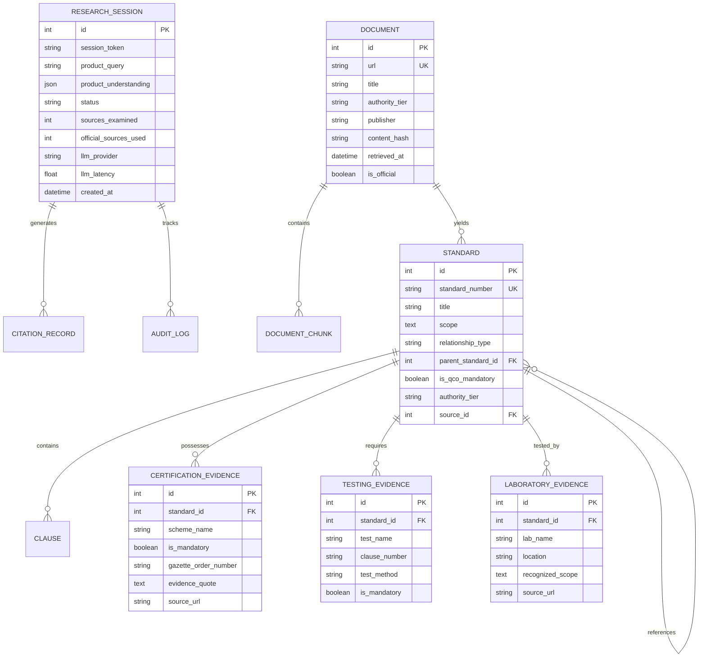

# BIS-Compass — System Architecture Specification

## 1. Executive Summary & Core Engineering Rule

**BIS-Compass** is an open-world, live-retrieval, evidence-grounded regulatory compliance intelligence platform designed for Indian Standards (Bureau of Indian Standards — BIS), Quality Control Orders (QCOs), certification schemes, testing requirements, and accredited laboratory discovery.

The system departs fundamentally from legacy compliance tools that rely on static databases, hardcoded product-to-standard whitelists, or hallucinated AI claims. Instead, BIS-Compass implements a **Source-First, Dynamic Evidence-Grounded Architecture** where the database acts solely as a dynamic cache and audit store, while the original, authoritatively retrieved government document remains the only source of truth.

---

### Rule 0: Absolute Rule of Truth & Non-Invention

```text
                                 RULE 0: NEVER INVENT
The application MUST NEVER invent Indian Standards, standard numbers, standard titles,
scopes, clauses, certification schemes, mandatory/voluntary status, QCO applicability,
testing requirements, test methods, laboratories, laboratory accreditation, regulatory
requirements, source URLs, citation text, compliance percentages, or applicability scores.
```

If authoritative evidence is absent or inconclusive, the platform strictly abstains via:
* `NOT VERIFIED`
* `NEEDS CLARIFICATION`
* `NO AUTHORITATIVE EVIDENCE FOUND`

```text
                             ACCURACY HIERARCHY
                VERIFIED ANSWER (Authoritative Evidence)
                                     >
                 PARTIAL ANSWER (Grounded with Limits)
                                     >
                         CLARIFICATION REQUIRED
                                     >
                         NO VERIFIED RESULT FOUND
                                     >
                        [WRONG ANSWER: UNACCEPTABLE]
```

---

## 2. High-Level System Architecture

The following diagram illustrates the end-to-end data pipeline from user input to final truthful synthesis:

```mermaid
flowchart TD
    User([User Query / Product Description]) --> OWA[Open-World Product Analyzer\n(NVIDIA NIM Llama-3.2)]
    
    subgraph S1 [Stage 1: Product Understanding]
        OWA --> CleanProduct[Separated Product Name]
        OWA --> Intent[Commercial Intent]
        OWA --> MatTree[Material & Application Hierarchy]
        OWA --> RegDomains[Regulatory Domain Detection]
        OWA --> AmbiguityCheck{Ambiguous\nInput?}
    end
    
    AmbiguityCheck -- Yes --> ClarifyResp([Return Clarification Questions\n(CLARIFICATION_REQUIRED)])
    AmbiguityCheck -- No --> RP[Dynamic Compliance Search Planner]

    subgraph S2 [Stage 2: Authoritative Discovery & Retrieval]
        RP --> BIS_API[Official BIS AJAX Endpoints\nservices.bis.gov.in]
        RP --> LiveWeb[Multi-Engine Live Search\nsite:bis.gov.in / Gazette]
        BIS_API --> DocParser[Document Parser & Content Extractor\n(HTML / PDF)]
        LiveWeb --> DocParser
        DocParser --> TierClassifier[Authority Tier Classifier\n(Tier 1: BIS, Tier 2: Gov, Tier 3: Standards Body)]
        TierClassifier --> EvCache[(Dynamic Evidence Store\n& Vector/Lexical Index)]
    end

    subgraph S3 [Stage 3: Standards Discovery & Entity Resolution]
        EvCache --> SD[Standard Discovery Engine]
        SD --> TitleExtractor[Official Title & Version Regex]
        TitleExtractor --> EntityResolver[Standard Entity Resolution Engine]
        EntityResolver --> PrimaryStd[PRIMARY_PRODUCT_STANDARD]
        EntityResolver --> RefStd[REFERENCED_STANDARD / MATERIAL_STANDARD]
        EntityResolver --> TestStd[TEST_METHOD_STANDARD]
    end

    subgraph S4 [Stage 4: Domain Compliance Analysis]
        PrimaryStd --> AppSvc[Applicability & Scope Engine]
        PrimaryStd --> CertAgent[Certification & QCO Agent]
        PrimaryStd --> TestAgent[Testing Requirements Agent]
        TestAgent --> LabAgent[Laboratory Matching Agent]
    end

    subgraph S5 [Stage 5: Citation & Evidence Verification]
        CertAgent --> CiteVerifier[Citation Verification Agent]
        TestAgent --> CiteVerifier
        LabAgent --> CiteVerifier
        AppSvc --> CiteVerifier
        CiteVerifier --> FinalSynth[Truthful Evidence Synthesis Engine]
    end

    FinalSynth --> FinalReport([Final Evidence-Grounded Report\n(User UI / REST API)])
```

---

## 3. Core Architectural Tenets

### 3.1 Zero-Seed Independence
A completely empty database (0 standards, 0 clauses, 0 schemes, 0 laboratories, 0 products) is a valid initial state. When an arbitrary user query arrives:
1. The system performs dynamic web and portal discovery;
2. Authoritative documents (`.pdf`, `.html`, official gazette notifications) are fetched in real-time;
3. Document chunks, extracted standards, and scope statements are dynamically persisted to the evidence cache;
4. The analysis executes entirely from the newly retrieved evidence.

### 3.2 Dual Database Strategy (PostgreSQL + SQLite Development Fallback)
* **Production**: PostgreSQL with relational tables, foreign key constraints, JSONB attributes, and transaction management.
* **Development / CI**: Automatic, zero-configuration fallback to local SQLite (`bis_compass.db`) with dynamic schema migration via `init_db()`.
* **Audit Role**: The database is never treated as the authoritative ground truth—it serves strictly as a **dynamic evidence cache, vector/lexical index, and immutable audit trail**.

### 3.3 Strict Entity Resolution Taxonomy
To prevent referenced raw material specifications from contaminating primary product results (e.g., treating `IS 5856` steel sheets as a primary vacuum bottle standard), standards are strictly resolved into distinct entity classes:

```text
+----------------------------+--------------------------------------------------------------+
| Entity Class               | Description & Governing Scope                                |
+----------------------------+--------------------------------------------------------------+
| PRIMARY_PRODUCT_STANDARD   | Direct product specification defining the end-use article    |
| REFERENCED_STANDARD        | Standard cited in clauses for supporting compliance          |
| MATERIAL_STANDARD          | Raw material or chemical composition specification           |
| TEST_METHOD_STANDARD       | Standard specifying test apparatus, procedures, or metrics   |
| COMPONENT_STANDARD         | Specification governing an integrated sub-component          |
| REGULATORY_DOCUMENT        | Quality Control Order (QCO), Gazette notification, or decree  |
+----------------------------+--------------------------------------------------------------+
```

### 3.4 Categorical Scope Decisions over Synthetic Percentages
Numerical match scores (e.g., `77%`) are banned from standalone compliance claims. Decisions must be categorical:
* `APPLICABLE`: Primary product scope explicitly covers the article.
* `POTENTIALLY_APPLICABLE`: Product family matches, but specific scope parameters (weave, voltage, demographic) require clarification.
* `RELATED`: Standard is referenced or governing raw materials, not the primary finished good.
* `NOT_APPLICABLE`: Clear category, voltage, material, or application mismatch.
* `NEEDS_CLARIFICATION`: Query lacks sufficient technical detail.

---

## 4. Subsystem Deep Dives

### 4.1 Open-World Product Intelligence (`OpenWorldProductAnalyzer`)
Located in [`backend/app/services/products/open_world_analyzer.py`](file:///e:/SIH2026/project/BIS-Compass/backend/app/services/products/open_world_analyzer.py).

* **Responsibility**: Parses unconstrained natural language queries into structured product intelligence schemas using NVIDIA NIM LLM inference (`meta/llama-3.2-11b-vision-instruct`).
* **Commercial Intent Separation**:
  - Input: `"I want to sell my groundnut oil across India"`
  - Extracted Product Name: `"Groundnut Oil"`
  - Commercial Intent: `"Sell"`
  - Target Market: `"India"`
  - Regulatory Domain: `["Food & Agriculture"]`
  - Conversational preambles (`"I want to sell"`, `"We manufacture"`) are sanitized.
* **Material Subordination**: Materials (e.g., Stainless Steel) are kept as subordinate attributes of the product (e.g., Vacuum Bottle) to prevent search contamination.
* **No "General Manufacturing" Fallback**: Vague queries (`"We manufacture steel products"`) trigger `clarification_required = True` with 4 structured diagnostic questions rather than defaulting to generic classifications.

```json
{
  "product_name": "Stainless Steel Vacuum Insulated Drinking Bottle",
  "normalized_name": "stainless steel vacuum insulated drinking bottle",
  "commercial_intent": "Manufacture",
  "materials": ["Stainless Steel"],
  "intended_use": "Domestic beverage storage and consumption",
  "application": "Household / Consumer retail",
  "physical_form": "Cylindrical insulated flask",
  "possible_regulatory_domains": ["Consumer Goods", "Mechanical & Metallurgy"],
  "clarification_required": false,
  "confidence": 0.95
}
```

---

### 4.2 Live Research & Authoritative Discovery Engine
Located in [`backend/app/services/research/`](file:///e:/SIH2026/project/BIS-Compass/backend/app/services/research/).

#### Official BIS Discovery Service (`bis_discovery.py`)
Directly integrates with the live Bureau of Indian Standards portal API endpoints:
1. **Title & Keyword Search**:
   `POST https://www.services.bis.gov.in/php/BIS_2.0/bisconnect/knowyourstandards/Elasticsearch/gettitlesearchAjax`
   Queries live BIS Elasticsearch index for active Indian Standards.
2. **Numeric IS Details**:
   `POST https://www.services.bis.gov.in/php/BIS_2.0/bisconnect/knowyourstandards/Indian_standards/isdetails/`
   Retrieves official committee, gazette status, and revision history.
3. **Mandatory QCO & Gazette Details**:
   `POST https://www.services.bis.gov.in/php/BIS_2.0/bisconnect/knowyourstandards/Is_gazattedetails/getgazattedetailsAjax`
   Authoritatively verifies Quality Control Orders and Gazette notification numbers.
4. **Recognized Laboratories**:
   `POST https://www.services.bis.gov.in/php/BIS_2.0/bisconnect/knowyourstandards/Is_labs/getlabs`
   Retrieves currently empanelled and BIS-recognized laboratories for a specific standard ID.

#### Multi-Engine Live Search (`search_providers.py` & `web_research_engine.py`)
* Employs live DDGS and web retrieval to discover official PDF Product Manuals (e.g., `PM-IS-17526.pdf`), guidelines, and Gazette notifications.
* Formulates targeted multi-domain queries: `(site:bis.gov.in OR site:services.bis.gov.in)`.
* **Authority Tier Classification**:
  - **Tier 1**: Official BIS domains (`bis.gov.in`, `services.bis.gov.in`).
  - **Tier 2**: Official Indian Government Ministries (`egazette.gov.in`, `dpiit.gov.in`, `fssai.gov.in`).
  - **Tier 3**: International Standards Organizations (ISO, IEC, ASTM).
  - **Tier 4**: Recognized industry associations.
  - **Tier 5**: General web (blogs, marketing sites) — **strictly excluded from standard discovery**.

---

### 4.3 Standard Discovery & Entity Resolution Engine
Located in [`backend/app/services/research/standard_discovery.py`](file:///e:/SIH2026/project/BIS-Compass/backend/app/services/research/standard_discovery.py) and [`backend/app/services/standards/applicability_service.py`](file:///e:/SIH2026/project/BIS-Compass/backend/app/services/standards/applicability_service.py).

* **Regex Extraction**: Matches official standard patterns (`IS \d+(?:-\d+)*(?::\d{4})?`).
* **Title Extraction from Authoritative Documents**:
  - Extracts titles using strict patterns: `ACCORDING TO IS \d+[:\s]+([^\n\r,]+)` or `PRODUCT MANUAL FOR ([^\n\r]+) ACCORDING TO`.
  - Filters out publisher strings (e.g., rejecting `"Bureau of Indian Standards"` as a standard title).
* **Version Deduplication**: If both `IS 17526` and `IS 17526:2021` are discovered in the same research session, the unversioned reference is automatically collapsed into the versioned entry.
* **Contextual Entity Resolution**:
  - In a Product Manual for `IS 17526:2021`, standards cited in Section 2 (Raw Materials) or Section 3 (Test Equipment) such as `IS 5856`, `IS 15997`, `IS 5522`, `IS 9730`, and `IS 9806` are tagged as `REFERENCED_STANDARD` or `MATERIAL_STANDARD`.
  - Only `IS 17526:2021` is evaluated as the `PRIMARY_PRODUCT_STANDARD`.

---

### 4.4 Domain Compliance Micro-Agents

All micro-agents follow a strict **No Evidence $\rightarrow$ Safe Abstention** contract:

#### 1. Certification & QCO Agent (`certification_agent.py`)
- Evaluates whether BIS certification (ISI Mark Scheme I, CRS Scheme II, etc.) is mandatory or voluntary.
- **Rule**: Standard existence does NOT imply mandatory certification. A standard is only marked `license_required = True` if:
  1. An official QCO or Gazette order is retrieved in live research; OR
  2. The BIS Gazette endpoint (`Is_gazattedetails`) returns active mandatory orders.
- If no QCO text is present, returns `license_required = False` and `certification_scheme = "NOT_VERIFIED"`. Never produces `"Target Standard: Unknown | Scheme I | Mandatory"`.

#### 2. Testing Requirements Agent (`testing_agent.py`)
- Extracts mandatory and routine tests directly from retrieved Product Manuals (STI - Scheme of Testing and Inspection).
- Every test requirement must include: `test_name`, `clause`, `test_method_standard`, `mandatory_status`.
- **Eliminated**: Generic boilerplate tables, `"IS Unknown"`, synthetic lab testing durations, and fabricated pricing ranges.

#### 3. Laboratory Matching Agent (`laboratory_agent.py`)
- Discovers testing laboratories via official BIS `Is_labs` lookups and live domain searches.
- **Eliminated**: Synthetic seed fallback injection (`_build_seed_candidates`). Food testing or toxicology laboratories are strictly prohibited from appearing in non-food hardware results.

#### 4. Compliance Gap Analysis Agent (`compliance_gap_agent.py`)
- Analyzes uploaded user test reports, data sheets, or quality manuals against live-researched requirements.
- **Mathematical Calculation Basis**:
  $$\text{Compliance Score} = \frac{\text{Satisfied Requirements}}{\text{Assessable Requirements}} \times 100$$
  Displays verified counts: `Verified: 10 | Satisfied: 7 | Potential Gaps: 2 | Not Assessable: 1`. Never outputs ungrounded percentages.

---

### 4.5 LLM Provider & Execution Telemetry (`NVIDIAProvider`)
Located in [`backend/app/services/llm/nvidia_provider.py`](file:///e:/SIH2026/project/BIS-Compass/backend/app/services/llm/nvidia_provider.py).

* **Provider**: NVIDIA NIM API (`https://integrate.api.nvidia.com/v1`).
* **Active Model**: `meta/llama-3.2-11b-vision-instruct`.
* **Fallback Chat Model**: `meta/llama-3.1-70b-instruct`.
* **Execution Telemetry**: Every analysis session records:
  - `llm_provider`: e.g. `"NVIDIA NIM"`
  - `llm_model`: e.g. `"meta/llama-3.2-11b-vision-instruct"`
  - `llm_called`: `True` / `False`
  - `llm_calls_count`: Number of API round-trips
  - `llm_latency`: Total elapsed execution time (ms)
  - `llm_error`: Error payload (if any)
* **Real Health Monitoring**: `GET /api/ai/health` executes a live ping against NVIDIA NIM, returning actual latency (e.g., `366ms`) and reachability status.

---

## 5. Database Schema & Data Models

The relational schema is defined in [`backend/app/models/standard.py`](file:///e:/SIH2026/project/BIS-Compass/backend/app/models/standard.py):



---

## 6. API Architecture & Endpoint Reference

| HTTP Method | Route | Purpose | Key Request/Response Fields |
| :--- | :--- | :--- | :--- |
| `POST` | `/api/analyze` | Executes end-to-end live compliance research | **In**: `product_description`, `include_web_search`<br>**Out**: `applicable_standards`, `related_standards`, `clarification_questions`, `sources_summary`, `telemetry` |
| `GET` | `/api/ai/health` | Live health probe for NVIDIA NIM LLM provider | **Out**: `configured`, `reachable`, `provider`, `model`, `latency_ms`, `error` |
| `GET` | `/api/research/health`| Live health probe for BIS API & Web Search engine | **Out**: `search_engine_status`, `bis_portal_reachable`, `latency_ms` |
| `POST` | `/api/compliance/gap-analysis`| Analyzes document against live standards | **In**: Uploaded file (`.pdf`/`.docx`), `product_id`<br>**Out**: `overall_score`, `verified_requirements`, `gaps`, `calculation_basis` |
| `GET` | `/api/standards/{number}` | Fetches standard details, scope, and relationships | **Out**: `standard_number`, `title`, `scope`, `relationship_type`, `referenced_by` |
| `GET` | `/api/laboratories/search` | Searches labs matching standard & scope | **In**: `standard_number`, `location`<br>**Out**: `laboratories`: `[name, location, scope, source_url]` |
| `GET` | `/api/audit/sessions` | Immutable compliance research audit log | **Out**: Paginated list of past research traces, inputs, sources, decisions |
| `POST` | `/api/chat/query` | Interactive compliance clarification dialog | **In**: `session_token`, `user_reply`<br>**Out**: `clarified_decision`, `updated_analysis` |

---

## 7. Frontend Architecture (`frontend/src/`)

Built with React 18, TypeScript, Tailwind CSS, and Vite:

* **Truthful Status Indicators**:
  - `LIVE WEB RESEARCH GROUNDED` (Green badge with pulsing indicator) displayed **only** when `official_sources_used > 0`.
  - `SECONDARY RESEARCH (0 OFFICIAL BIS SOURCES)` (Amber badge) displayed if only secondary sources were reached.
* **Segregated Standards Hierarchy**:
  - **Direct Product Standards Card**: Highlights verified `PRIMARY_PRODUCT_STANDARD` entries.
  - **Referenced & Supporting Standards Card**: Displays raw materials and test method standards cited in clauses, explaining their supporting role to prevent user confusion.
  - **Potentially Relevant (Needs Clarification) Card**: Displays candidate standards with interactive `+ Add Details to Description` button for 1-click refinement.
* **Interactive Research Execution Trace Drawer**:
  - Collapsible drawer detailing all executed queries, hits per query, and accepted vs rejected URLs.
* **Statutory Compliance Notice (Section 67)**:
  - Prominently placed at the foot of every generated report:
    > *"Information derived from verified sources. This system provides compliance decision support and does not replace professional regulatory or legal advice."*

---

## 8. Verification & Permanent Regression Suite

BIS-Compass maintains a 28-test automated regression suite in [`scripts/run_master_regression.py`](file:///e:/SIH2026/project/BIS-Compass/scripts/run_master_regression.py), validating all permanent benchmark cases defined in Sections 58–60:

```text
==================================================================
  BIS-COMPASS MASTER PRODUCTION REMEDIATION REGRESSION SUITE
==================================================================
  [PASS] Test A.1: Product Extraction ('100% Combed Cotton T-Shirt')
  [PASS] Test A.2: Domain Sanity (No BEE Energy: ['Textiles & Apparel'])
  [PASS] Test A.3: Rejects IS 694 (PVC Cables: NOT_APPLICABLE)
  [PASS] Test A.4: Rejects IS 302-2-21 (Water Heaters: NOT_APPLICABLE)
  [PASS] Test A.5: Demands Clarification for IS 4375 (Demographic/Knitted scope)
  [PASS] Test B.1: Separates Bottle from Stainless Steel Material
  [PASS] Test B.2: IS 17526 is PRIMARY_PRODUCT_STANDARD
  [PASS] Test B.3: IS 5856 is MATERIAL_STANDARD / RELATED
  [PASS] Test B.4: IS 15997 is MATERIAL_STANDARD / RELATED
  [PASS] Test B.5: Zero Toxicology/Food Labs Recommended for Vacuum Flask
  [PASS] Test C.1: Clean Product Name ('Groundnut Oil')
  [PASS] Test C.2: Commercial Intent Separated ('Sell')
  [PASS] Test C.3: No Conversational Preamble ('want to sell' removed)
  [PASS] Test D.1: Matches IS 694 (Cable Standard: APPLICABLE)
  [PASS] Test D.2: Rejects IS 17526 (Vacuum Flask: NOT_APPLICABLE)
  [PASS] Test E.1: Vague Material Triggers Clarification
  [PASS] Test E.2: Clarification Questions Provided (4 detailed questions)
  [PASS] Test E.3: No Fake 'General Manufacturing' Family
  [PASS] Test F.1: Novel Product Understood (Seaweed Packaging Film)
  [PASS] Test F.2: Food/Packaging Domain Inferred
  [PASS] Test G.1: Complex Multi-Disciplinary Product Extracted (Smart Textile)
  [PASS] Test G.2: Physical Form Not 'Manufactured Item' ('Thin flexible patch')
  [PASS] Test Cert.1: No Mandatory Assumption on Missing Data (Safe Abstention)
  [PASS] Test Cert.2: Scheme is NOT_VERIFIED
  [PASS] Test Test.1: No 'IS Unknown' Tests
  [PASS] Test Test.2: No Fabricated Pricing/Duration
  [PASS] Test Test.3: No Default CPRI/NTH Labs
  [PASS] Test DB.1: Database Verified and Connected (Empty DB Startup)
==================================================================
  TOTAL: 28 | PASSED: 28 | FAILED: 0
==================================================================
```

---

## 9. Deployment & Security Architecture

* **Containerization**: `docker-compose.yml` defining PostgreSQL 15 and FastAPI backend services.
* **Network & LAN Configuration**:
  - Server binds to `0.0.0.0` for local and LAN accessibility across the testbed.
  - CORS strictly configured to allow local frontend and authorized network origins.
* **Security & Secret Hygiene**:
  - All LLM API keys (`NVIDIA_API_KEY`) and database credentials are held strictly in backend environment variables.
  - Zero API keys or secrets are exposed to the frontend bundle.
  - Uploaded compliance documents are processed in isolated memory streams with MIME-type validation and size limits (max 25MB).
